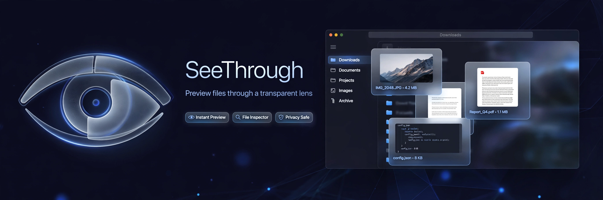

# SeeThrough

> ## Status: 🟢 Completed
>
> <progress value="90" max="100"></progress>
> **Progress: 90%** — Full-featured macOS preview app; needs a real Mac build to ship.

<p align="center">
  
</p>


## What it is

SeeThrough is a macOS menu-bar utility that does what Quick Look is bad at. Press **⌥Space** and whatever is selected in Finder previews in a floating panel — Esc closes it. Since macOS won't let anything replace Finder's own spacebar, SeeThrough uses its own hotkey (with an optional system-wide `CGEventTap` to steal plain Space). It lives entirely in the menu bar as an eye icon; there is no Dock icon and no preferences window.

## What works (verified)

- ✅ Video preview — `AVPlayerView` with real scrubbing, PiP and fullscreen (mp4, mov, m4v), handles multi-hour files — verified by code read of `VideoPreview.swift`
- ✅ Non-AVFoundation video (mkv, avi) — poster frame pulled via `ffmpeg`, plus codec, resolution, audio channels, duration and size — `FFmpeg.swift`
- ✅ Folder preview — files inside with icons, names, sizes, subfolder item counts, folders first like Finder — `FolderPreview.swift`
- ✅ Archive preview — zip/tar/tar.gz member list with sizes read from the central directory; nothing extracted — `ArchivePreview.swift`
- ✅ Fallback — anything else falls through to Quick Look itself (images, PDFs, text, code)
- ✅ Hotkey options — ⌥Space, ⌃Space, ⌘⇧Space, or plain Space via event tap — `HotKey.swift`, `SpaceTap.swift`
- ✅ Menu-bar controls — preview action, hotkey picker, mute toggle, open at login, quit — `StatusItem.swift`
- ✅ Hand-rolled `.app` bundle build with ad-hoc codesigning — `build.sh`, `release.sh`

> Verified by reading all 14 Swift source files (~830 lines). Swift cannot compile on this Linux machine, so the build was not executed here.

## Tech stack

| Layer | Tech |
|---|---|
| Language | Swift 6.0 |
| UI | AppKit (`AVPlayerView`, `NSPanel`, `NSStatusItem`) |
| Hotkeys | `CGEventTap`, global event monitor |
| Video fallback | `ffmpeg` (external binary) |
| Build | `swift build -c release` + hand-rolled `.app` bundle (no Xcode project) |
| Platform | macOS 14+ |

## How to run

```bash
# Build the .app bundle (macOS only)
./build.sh
# → produces SeeThrough.app in the repo root

# Or build the binary directly
swift build -c release

# Release build (see release.sh for notarization steps)
./release.sh
```

Look for the **eye icon in the menu bar**, then press **⌥Space** with a Finder selection.

## Screenshots

No screenshots ship with the repo. The banner above is the visual; the app itself is a floating preview panel + menu-bar icon.

## What you can add more

- [ ] DMG installer with drag-to-Applications — easier distribution than a bare `.app`
- [ ] Sparkle auto-updates — the app has no update mechanism today
- [ ] More archive formats — 7z, rar member listing
- [ ] Thumbnail grid for folders — currently a list; a grid would feel more Finder-like
- [ ] Preview for audio files — waveform + metadata, the one media type not covered
- [ ] Settings persistence UI — hotkey choice currently lives only in the menu

## Project structure

```
SeeThrough/
├── Sources/SeeThrough/
│   ├── App.swift            # App entry, menu-bar setup
│   ├── AppDelegate.swift    # Lifecycle
│   ├── StatusItem.swift     # Eye icon + control menu
│   ├── HotKey.swift         # ⌥Space / ⌃Space / ⌘⇧Space handling
│   ├── SpaceTap.swift       # CGEventTap to steal plain Space
│   ├── PreviewPanel.swift   # Floating preview window
│   ├── PreviewFactory.swift # Picks previewer per file type
│   ├── VideoPreview.swift   # AVPlayerView scrubbing, PiP
│   ├── FFmpeg.swift         # Poster frames for mkv/avi
│   ├── FolderPreview.swift  # Folder contents listing
│   ├── ListPreview.swift    # Archive member listing
│   ├── ArchivePreview.swift # zip/tar central-directory reader
│   ├── FinderSelection.swift# Reads Finder's current selection
│   └── Settings.swift       # Persisted preferences
├── Resources/Info.plist
├── build.sh                 # Builds SeeThrough.app
└── release.sh               # Release packaging
```

---
*README written after code audit on 2026-10-08.*
